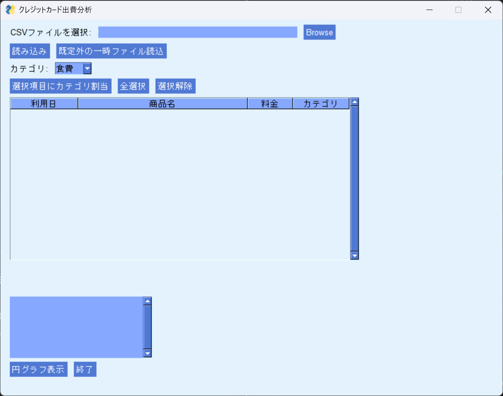

# 💳 クレジットカード出費分析ツール

このプログラムは、**楽天カードの利用明細（CSV）を読み込み、支出をカテゴリ別に集計し、円グラフで可視化するツール**です。  
家計管理を効率化したい方に最適な、シンプルなデスクトップアプリです。

---

## 📌 画面イメージ

| メイン画面 |
|------------|
|  |

---

## ✨ 主な機能

| 機能 | 説明 |
|-------|------|
| CSV読み込み | 楽天カードの明細を自動読込 |
| 明細の一覧表示 | 利用日 / 商品名 / 金額 を表形式で表示 |
| カテゴリ分類 | 自分でカテゴリを割り当てられる |
| 円グラフ生成 | カテゴリごとの支出割合を可視化 |
| 一時ファイル読込 | 過去データや外部CSVにも対応 |

---

## ✅ 操作方法

1. **CSVファイルを選択**  
   楽天カードの利用明細（CSV）を指定します。

2. **「読み込み」をクリック**  
   明細が画面の表に読み込まれます。

3. **カテゴリを割り当てる（任意）**  
   - 表の行を選択
   - プルダウンでカテゴリを選択
   - **「選択項目にカテゴリ割当」**ボタンを押す

4. **円グラフ表示ボタンを押す**  
   → カテゴリごとの支出割合が円グラフで表示されます

---

## 🗂 対応フォーマット

- **楽天カード CSV**
- ただし「利用日 / 商品名 / 料金」の列があれば他カードでも流用可能

---

## 🛠 開発環境 / 使用ライブラリ

| 種類 | 内容 |
|-------|------|
| 言語 | Python |
| GUI | PySimpleGUI(4.60.4.1) |
| グラフ | matplotlib |
| 表示 | pandas |

---

## 📌 今後の拡張予定（任意）

- 自動カテゴリ判定（キーワード辞書）
- 月別推移グラフ
- 家計簿アプリ連携

---

## 📄 ライセンス

This software is released under the MIT License.

---

## 👤 作者

RinYoshino

---

